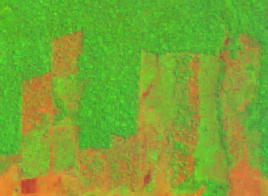

```{r, setup, include=FALSE, echo = FALSE}
options(prompt = 'R> ', continue = '+ ')
options(warn = -1)
# if terra is not installed, install it
if (!requireNamespace("terra", quietly = TRUE))
    install.packages("terra", repos = "https://cloud.r-project.org/")
library(terra)
# if bayesEO is not installed, install it
if (!requireNamespace("bayesEO", quietly = TRUE))
    devtools::install_github("e-sensing/bayesEO")
library(bayesEO)
# if sitsdata is not installed, get it
if (!requireNamespace("sitsdata", quietly = TRUE))
    devtools::install_github("e-sensing/sitsdata")
library(sitsdata)
knitr::opts_chunk$set(echo = TRUE, fig.pos = "h")
knitr::opts_chunk$set(message = FALSE)
knitr::opts_chunk$set(warning = FALSE)
tempdir = "./temp_dir"
```
\newpage
# Introduction

Machine learning methods such as support vector machines \citep{Mountrakis2011}, random forests \citep{Belgiu2016}, and deep learning \citep{Ma2019} have become indispensable in the field of remote sensing image classification. These techniques typically rely on training samples that are derived from "pure" pixels, handpicked by users to represent the desired output classes.  However, considering the presence of mixed pixels in images regardless of resolution, and the considerable data variability within each class, these classifiers often produce results with outliers or misclassified pixels. Therefore, post-processing techniques have become crucial to refine the labels of a classified image, thereby enhancing its accuracy \citep{Huang2014}.


Post-processing is a necessary step in remote sensing image classification. They reduce the salt-and-pepper effect, where single pixels or small groups of pixels are classified differently from their larger surrounding areas; this effect leads to visual discontinuity and inconsistency. By mitigating these errors and minimizing noise, post-processing improves the quality of the initial classification results.  There is a significant gain in the overall accuracy and interpretability of the final output [@Schindler2012].


Most post-processing methods use the smoothness assumption that nearby pixels tend to have the same label \citep{Schindler2012}. These include probability-based smoothing methods such as Gaussian and edge-aware filtering \citep{Schindler2012}, modal filters \citep{Ghimire2010}, and probabilistic relaxation \citep{Gong1989}. The method proposed by \citet{Huang2014} involves a relearning method based on co-occurrence matrices, which represent the joint distribution of class labels in the vicinity of each pixel. In this paper, we propose a post-processing algorithm founded on Bayesian statistics.

Most post-processing methods operate under the "smoothness assumption" that nearby pixels are likely to have the same label \citep{Schindler2012}. These include probability-based smoothing methods such as Gaussian and edge-aware filtering \citep{Schindler2012}, modal filters \citep{Ghimire2010}, and probabilistic relaxation \citep{Gong1989}. The method proposed by \citet{Huang2014} involves a relearning method based on co-occurrence matrices, which represent the joint distribution of class labels in the vicinity of each pixel. In contrast, we propose a post-processing algorithm founded on Bayesian statistics.

Bayesian inference is a way of coherently update our uncertainty in the  light of new evidence. It can consider expert knowledge on the derivation of  probabilities. In Spatial Statistics, Bayesian inference has been used in many problems, including the analysis of remote sensing images expressed as lattice data. Lattice processes {$Y(\mathbf{s}): \mathbf{s} \in D_s$} are defined on a finite and countable subset $D_s$ of	$\mathbb{R}^d$ [@Cressie2011], consisting of discrete spatial locations such as pixels or administrative units. The standard model for lattice data is a spatial process $\mathbb{Z} \equiv (Z(\mathbf{s}_1), ..., Z(\mathbf{s}_n))$, where $S = {\mathbf{s}_1, ..., \mathbf{s}_n}$ are the locations. These spatial random process are associated to a single continuous variable, e.g., temperature distribution on the Earth's surface. While assumptions of spatial continuity and dependence hold true for all locations within the lattice space for continuous variables, they cannot be extended to land classification scenarios.

The problem of land classification can be expressed as follows. Given a set of spatial locations $S = {\mathbf{s}_1, ..., \mathbf{s}_n}$ and a set of land classes $L = {l_1, ..., l_k}$, we seek a classification function such that
\begin{equation}
f: S \to L, \forall s \in S, f(s) = (p_1(l_1), ...p_k(l_k)), \sum_{(i = 1,..,k)}p_i(l_i) = 1
\end{equation}

For each pixel, the classification function produces a set of class probabilities that sum to 100%. The function $f$ is obtained from a training dataset $T = {(s_1, l_{s1}),..,(s_m, l_{sm})}$ where for a subset $S_m \in S$ we have acess to one label per location. In the general case, the subset $S_m$ is much smaller than $S$.  

The unique nature of land classification, compared to other forms of spatial analysis, lies in the behavior of the random processes linked to the spatial locations. Land classification aims to subdivide space into discrete areas, each associated with a distinct type of land use or cover. IConsequently, the random processes correlated with each class are not spatially continuous. Take, for instance, Figure @ref(fig:roim) showcasing a fragment of a Sentinel-2 image in the state of Rondonia, Brazil. The image starkly contrasts forest areas (depicted in green) and deforested areas (portrayed in various shades of orange and brown). In terms of spatial processes, there's a discontinuity at the borders separating forested and deforested regions. Therefore, in land classification we need to make different assumptions about the statistical properties of the data. These considerations serve to capture the unique spatial patterns and heterogeneity inherent in land classifications, which traditional spatial processes might not adequately represent.

```{r roim, echo = FALSE, fig.width = 5, fig.align="center", fig.cap= "Sentinel-2 image of deforestation in the Amazon forest (detail)."}


```

When modelling a multi-class land classification as a set of spatial processes, $\mathbb{Z}_i \equiv (Z_i(\mathbf{s}_1), ..., Z_i(\mathbf{s}_n))$, where $S = {\mathbf{s}_1, ..., \mathbf{s}_n}$ are the locations and where $i \in {1,..k}$ represents the land classes, we cannot assume that Tobler's First Law of Geography (*"everything is related to everything else, but near things are more related than distant things."*) holds between all spatial locations. Land classification produces results where spatial classes are associated to compact patches. Inside the patches, one can assume the existence of a random spatial process whose realization supports the properties of continuity and spatial correlation. However, such properties break at the borders between land classes. 

The application of Bayesian inference for the smoothing of land classification images, produced by machine learning techniques needs to make additional assumptions than traditional methods used in spatial statistics. We need to take into account discontinuities at the borders between land classes. Based on this considerations, in this paper we introduce the `bayesEO` package. This package presents a novel method for image post-processing, grounded in Bayesian statistics, which caters to the specific properties of land classification. We employ non-isotropic neighbourhood definitions to mimic the effects of discontinuity between land classes, enabling our method to better capture the spatial complexities inherent in such data. Our method allows the inclusion of expert knowledge, removes outliers, and enhances the consistency of the resulting map. To the best of our knowledge, this work represents the first proposal to utilize Bayesian inference for the post-processing of machine learning-based image classification. This innovation stands to substantially improve the accuracy and interpretability of land classification results.

<!--% TODO: include a paragraph about R packages following the style below
% PEDRO: Duas sugestoes:
% https://cran.r-project.org/web/packages/probably/ -> "Tools for Post-Processing Class Probability Estimates"
% https://www.mdpi.com/2076-3417/12/24/12554 -> "R Libraries for Remote Sensing Data Classification by K-Means Clustering and NDVI Computation in Congo River Basin, DRC"
-->
In \proglang{R}, ...include here a discussion of what's available in R, and 
include mention to the \pkg{sits} package.


# Methods

## Conversion from probabilities to logits

The proposed post-classification smoothing model considers the output of a machine learning algorithm that provides the probabilities of each pixel in the image to belong to target classes. More formally, let $p_{i,k}$ >= 0 be the probability of pixel $i$ belonging to class $k$, $k=1,\dots{},K$, where K is the number of classes, then

\begin{equation}
\sum_{k=1}^K p_{i,k} = 1.
\end{equation}

To make the inference tractable, the class probability values $p_{i,k}$ are converted to log-odds values. The logit function converts probability values in the interval $[0,1]$ to logit values in  $[-\infty, \infty]$, expressed by

\begin{equation}
x_{i,k} = \ln \left(\frac{p_{i,k}}{1 - p_{i,k}}\right).
\end{equation}

Confidence in pixel classification increases with logit. There are situations, such as border pixels or mixed ones, where the logit of different classes are similar in magnitude. These are cases of low confidence in the classification result. To assess and correct these cases, the post-classification smoothing method borrows strength from the neighbors.

## Bayesian inference

Once the probability values are converted into logits, we can frame the problem within a Bayesian context. As discussed in our earlier section on statistical models for land classification, each land class (e.g., "Forest", "Deforestation", "Grasslands") is linked to a distinct spatial process. Thus, the number of spatial processes equals the number of classes, and each process exhibits unique behaviours distinct from the others. This diversity in class behavior leads us to posit independence between the classes. Thus, for each spatial location, the model uses the probability values associated to each class as realization of a specific spatial process. This perspective allows us to account for the intricate spatial patterns and variations inherent to each land class in our Bayesian analysis.

We will then consider each pixel $i$ and class $k$ to be associated to a random variable $Z_{i,k}$. Given the probability value $x_{i,k}$  of class $k$ at pixel $i$ produced by the machine learning algorithm, we aim to estimate $E[\mu_{i,k} | x_{i,k}]$, the expected mean logit values which would correspond to the ground truth. The Bayesian inference procedure can be expressed as
<!--
% PEDRO: nao entendi acima
-->

\begin{equation}
\pi(\mu|x) \propto{} \pi(x|\mu)\pi(\mu).
\end{equation}

To estimate the conditional posterior distribution $\pi(\mu|x)$, we combine two distributions: (a) the distribution $\pi(x|\mu)$, known as the likelihood, which expresses how measured values $x_{i,k}$ depend in the unknown values $\mu_{i,k}$; and (b) $\pi(\mu)$, which is our guess on the actual data distribution, known as the prior. The update will be performed for each class $k$ separately.

The method assumes that the likelihood $x_{i,k} | \mu_{i,k}$ follows a normal distribution $N(\mu_{i,k}, \sigma^2_{k})$, with parameters $\mu_{i,k}$ and $\sigma^2_{k}$. The variance $\sigma^2_{k}$ will be estimated based on user expertise and taken as a hyperparameter to control the smoothness of the resulting estimate.

We will also assume a normal local prior for the parameter $\mu_{i,k}$ with parameters $m_{i,k}$ and $s^2_{i,k}$:

\begin{equation}
	\mu_{i,k} \sim N(m_{i,k}, s^2_{i,k}).
\end{equation}

The method assumes that the class probabilities in the spatial neighbourhood of the pixel also follow a normal distribution. Estimating the local means and variances for the prior distribution considers a spatial neighbourhood $N_{i}$ close to pixel $p_i$. Let $\#(N_{i})$ be the number of elements in the neighbourhood $N_{i}$. The mean value is given by

\begin{equation}
m_{i,k} = \frac{\sum_{(j) \in N_{i}} x_{j,k}}{\#(N_{i})}
\end{equation}

and the variance by

\begin{equation}
s^2_{i,k} = \frac{\sum_{(j) \in N_{i}} [x_{j,k} - m_{i,k}]^2}{\#(N_{i})-1}.
\end{equation}

Given these assumptions, the Bayesian update for the expected conditional mean 
${E}[\mu_{i,k} | x_{i,k}]$ is given by:

\begin{equation}
{E}[\mu_{i,k} | x_{i,k}] = \frac{m_{i,t} \times \sigma^2_{k} +
x_{i,k} \times s^2_{i,k}}{ \sigma^2_{k} +s^2_{i,k}},
\end{equation}

which can be expressed as a weighted mean

\begin{equation}
{E}[\mu_{i,k} | x_{i,k}] =
\Biggl [ \frac{s^2_{i,k}}{\sigma^2_{k} +s^2_{i,k}} \Biggr ] \times
x_{i,k} +
\Biggl [ \frac{\sigma^2_{k}}{\sigma^2_{k} +s^2_{i,k}} \Biggr ] \times m_{i,k},
\end{equation}

where:

\begin{itemize}
\item $x_{i,k}$ is the logit value for pixel $i$ and class $k$.
\item $m_{i,k}$ is the average of logit values for pixels of class $k$ 
in the neighborhood of pixel $i$.
\item $s^2_{i,k}$ is the variance of logit values for pixels of class $k$ 
in the neighborhood of pixel $i$.
\item $\sigma^2_{k}$ is the likelihood variance for class $k$, 
an user-derived hyperparameter.
\end{itemize}

The above equation is a weighted average between the value $x_{i,k}$ for the pixel and the mean $m_{i,k}$ for the neighboring pixels. When the variance $s^2_{i,k}$ for the neighbors is too high, the algorithm gives more weight to the pixel value $x_{i,k}$. When the variance of the likelihood $\sigma^2_k$ increases, the method gives more weight to the neighborhood mean $m_{i,k}$.


## Effect of the hyperparameter

The parameter $\sigma^2_k$ controls the level of smoothness. If $\sigma^2_k$ is zero, the estimated value ${E}[\mu_{i,k} | x_{i,k}]$ will be the pixel value $x_{i,k}$. Values of the likelihood variance $\sigma^2_{k}$, which are small relative to the prior variance $s^2_{i,k}$ increase our confidence in the original probabilities. Conversely, likelihood variances $\sigma^2_{k}$, which are large relative to the prior variance $s^2_{i,k}$, increase our confidence in the average probability of the neighborhood.

Thus, the parameter $\sigma^2_{k}$ expresses confidence in the inherent variability of the distribution of values of a class $k$. The smaller the parameter $\sigma^2_{k}$, the more we trust the estimated probability values produced by the classifier for class $k$. 
Conversely, higher values of $\sigma^2_{k}$ indicate lower confidence in the classifier outputs and improved confidence in the local average values.

Consider the following two-class example. Take a pixel with probability $0.4$ (logit $x_{i,1} = -0.4054$) for class A, and probability $0.6$ (logit $x_{i,2} = 0.4054$) for class B. Without post-processing, the pixel will be labelled as class B. Consider a local average of $0.6$ (logit $m_{i,1} = 0.4054$) for class A and $0.4$ (logit $m_{i,2} = -0.4054$) for class B. This is an outlier classified as class B in the midst of a set of pixels of class A. Suppose a local variance of logits to be $s^2_{i,1} = 5$ for class A and $s^2_{i,2} = 10$ and for class B. This difference is to be expected if the local variability of class A is smaller than that of class B. To complete the estimate, we need to set the parameter $\sigma^2_{k}$, representing prior belief in the variability of the probability values for each class. If we take both  $\sigma^2_{A}$ for class A and $\sigma^2_{B}$ for class B to be both 10, the Bayesian  estimated probability for class A is $0.52$  and for class B is $0.48$. In this case, the pixel will be relabeled as being class A. If we set $\sigma^2$ to be 5 for both classes A and B, the Bayesian probability estimate will be $0.48$ for class A and $0.52$ for class B. In this case, the original class will be kept. Therefore, the result is sensitive to the subjective choice of the hyperparameter. 

## Defining non-isotropic neighbourhoods

The fundamental idea behind Bayesian smoothing for land classification posits that image patches with similar characteristics usually have a dominant class. This dominant class is marked by higher average probabilities and lower variance compared to other classes. In such regions, a pixel assigned to a different class is likely to exhibit lower average probabilities and higher local variance. As a result, post-processing should adjust the class of this pixel to match the dominant class.

Classification challenges arise for pixels located along the boundaries between areas containing different classes, as they possess signatures of two classes. In these cases, only some of the neighbours of such boundary pixels belong to the same class. To address this issue, we employ a non-isotropic definition of a neighbourhood to estimate the prior class distribution.

The non-isotropic neighborhood definition is selected as a subset of the logits of all values in a user-defined window. For instance, consider a boundary pixel with a neighborhood defined by a 7 x 7 window, located along the border between the \code{Forest} and \code{Grassland} classes. To estimate the posterior probability of the pixel being a \code{Forest}, we should only take into account the neighbours on one side of the border that are likely to be correctly classified as \code{Forest}. Pixels on the opposite side of the border should be disregarded, since they are unlikely to belong to the same spatial process. In practice, we use only half of the pixels in the 7 x 7 window, opting for those that have a higher probability of being \code{Forest}. For the probability of the \code{Grassland} class, we reverse the selection and only consider those on the opposite side of the border.

Although this choice of neighbourhood may seem unconventional, it is consistent with the assumption of non-continuity of the spatial processes describing each class. A dense forest patch, for example, will have pixels with strong spatial autocorrelation for values of the \code{Forest} class; however, this spatial autocorrelation doesn't extend across its border with other land classes.

# Software and examples

## Reading a probability data cube
 
The input for post-classification is an image with probabilities produced by a machine learning algorithm. This file should be multi-band, where each band contains the pixel probabilities of a single class. The file name must have information on reference dates and include a version number. In the examples, we use a file produced by a random forest algorithm applied to a data cube of Sentinel-2 images for tile "20LLQ" in the period 2020-06-04 to 2021-08-26. The image has been stored as INT2S data type with integer values between [0..10000] to represent probabilities ranging from 0 ro 1. 

```{r, echo = TRUE, eval = TRUE}
data_dir <- system.file("/extdata/Rondonia-20LLQ/", package = "sitsdata")
probs_file <- list.files(data_dir)
probs_file
```

The training data has six classes: (a) \code{Forest} for natural tropical forest; (b) \code{Water} for lakes and rivers; (c) \code{Wetlands} for areas where water covers the soil in the wet season; (d) \code{ClearCut_Burn} for areas where fires cleared the land after tree removal. (e) \code{ClearCut_Soil} where the forest has been removed; (f) \code{ClearCut_Veg} where some vegetation remains after most trees have been removed. The class labels should also be informed by the user, since they are not stored in image files. 

```{r, echo = TRUE, eval = TRUE}
labels <- c("Water", "ClearCut_Burn", "ClearCut_Soil",
            "ClearCut_Veg", "Forest", "Wetland")
```

The following code reads the file using the \code{terra} package. 

```{r, echo=TRUE, eval=TRUE}
probs_image <- terra::rast(paste0(data_dir,"/",probs_file))
names(probs_image) <- labels
```

The output is a \code{SpatRaster} object from the \code{terra} package. Figure \@ref(fig:pcube) shows the plot of all layer of the probability image. The map for class \code{Forest} shows high probability values associated with compact patches and linear stretches in riparian areas. Class \code{ClearCut_Soil} is mostly composed of dense areas of high probability whose geometrical boundaries result from forest cuts. By contrast, the probability maps for classes \code{Water}, \code{ClearCut_Burn}, and \code{ClearCut_Veg} have mostly low values. Note that we need to inform the scaling parameter that converts the image to [0..1] interval.

```{r pcube, width = 8, tidy="styler", fig.align = 'center', fig.cap = "Class probabilities produced by random forest algorithm."}
bayes_plot(probs_image, scale = 0.0001)
```

Figure \@ref(fig:map1) shows the resulting map, obtained by taking the class of higher probability to each pixel, without considering the spatial context. The non-smoothed labelled map shows the need for post-processing, since it contains a significant number of outliers and misclassified pixels. The map is produced by  \code{bayes_label()} whose parameter is a \code{SpatRaster} object containing the probabilities of each class for all pixels. Then the map is rendered using \code{bayes_map()}.

```{r, tidy = "styler", echo=TRUE, eval=TRUE}
map_no_smooth <- bayes_label(probs_image)
```

```{r map1, fig.width = 6, fig.align = 'center', fig.cap = "Labelled map without smoothing."}
bayes_map(map_no_smooth)
```

\newpage

## Estimating the local logit variances

The local logit variances correspond to the $s^2_{i,k}$ parameter in the Bayesian inference and are estimated by \code{sits_variance()}. Its main parameters are: (a) a \code{SpatRaster}  object ; (b) \code{window_size}, dimension of the local neighbourhood; (c) \code{neigh_fraction}, the percentage of pixels in the neighbourhood used to calculate the variance. The example below uses half of the pixels of a $7\times 7$ window to estimate the variance. The chosen pixels will be those with the highest probability pixels to be more representative of the actual class distribution. The output values are the logit variances in the vicinity of each pixel. 

```{r, echo=TRUE, eval=TRUE}
var_image <- bayes_variance(
    x = probs_image,
    window_size = 7)
bayes_summary(var_image)
```

The choice of the $7 \times 7$ window size is a compromise between having enough values to 
estimate the parameters of a normal distribution and the need to capture local effects 
for class patches of small sizes. Classes such as \code{Water} and \code{ClearCut_Burn}
tend to be spatially limited; a bigger window size could result in invalid values for
their respective normal distributions.

The summary statistics show that most local variance values are low, which is an expected result. Areas of low variance correspond to pixel neighborhoods of high logit values for one of the classes and low logit values for the others. High values of the local variances are relevant in areas of confusion between classes. Figure \@ref(fig:vcube) shows the values of local logit variances for classes \code{ClearCut_Soil} and \code{Forest}, considering only the $4^{th}$ quartile of the distribution. Only the top 25% of the values for each class are shown, emphasizing areas of high local variability. 

```{r vcube, fig.width = 8, tidy="styler", fig.align = 'center', fig.cap = "Logit variance map showing values above the 3rd quartile."}
bayes_plot(var_image, quantile = 0.75, labels = c("ClearCut_Soil", "Forest"))
```

Comparing the logit variance maps of Figure \@ref(fig:vcube) with the probability maps of Figure \@ref(fig:pcube) emphasizes the relevance of expert knowledge. The areas of high probability of class \code{Forest} are mostly made of compact patches; areas of high local variance occur near the borders of these patches. By contrast, class \code{ClearCut_Veg} represents a transition between natural forest areas and places where all trees have been cut, which are associated to class \code{ClearCut_Soil}. Class \code{ClearCut_Veg} has a high spectral variability, since the extent of remaining vegetation after most trees have been removed is not uniform. For this reason, the local variance of class \code{ClearCut_Veg} is mostly patch-based, while that of class \code{Forest} is mostly border-based. 

Further insights are provided by Figure \@ref(fig:vhist), which shows the histograms of local variances per class. The values shown correspond to the $4^{th}$ quartile (top 25% of all values). The distribution of logit variances is uneven between the classes. Class \code{ClearCut_Veg} has a more balanced distribution, while most values in the $4^{th}$ quartile of class \code{ClearCut_Soil} have low values. 

```{r vhist, fig.width = 8, tidy="styler", fig.align = 'center', fig.cap = "Histogram of top quartile of variances of class logits."}
bayes_hist(var_image, quantile = 0.75)
```

## Applying Bayesian smoothing to remove outliers


As discussed above, the effect of the Bayesian estimator depends on the values of the a priori variance $\sigma^2_{k}$ set by the user and the neighbourhood definition to compute the local variance $s^2_{i,1}$ for each pixel. To show the effects of different $\sigma^2$ values we consider two cases: (a) setting $\sigma^2$ to a high value close to the maximum value of local logit variance; (b) setting $\sigma^2$ to a lower value close to the minimum value of the $4^{th}$ quartile. To remove the outliers in the classification map, \pkg{bayesEO} provides \code{bayes_smooth()}. Its main parameters are: (a) \code{x}, a probability image; (b) \code{window_size},  dimension of the local neighbourhood; (c) \code{smoothness}, prior logit variances for each class. We first consider the case of high $\sigma^2$ values.

```{r, echo=TRUE, eval=TRUE}
smooth_high <- bayes_smooth(
    probs_image,
    window_size = 7,
    smoothness = c(25, 10, 20, 20, 25, 10)
)
```

The impact of Bayesian smoothing can be best captured by producing a labelled map using \code{bayes_label()}, taking the smoothed image as its input. Figure \@ref(fig:smth1) shows that the outliers and isolated pixels have been removed.

```{r smth1, fig.width = 6, fig.align = 'center', fig.cap = "Labeled map with smoothing with high smoothness values."}
map_smooth_high <- bayes_label(smooth_high)
bayes_map(map_smooth_high)
```

In the smoothed map, the outliers have been removed by expanding \code{Forest} areas. Forests have replaced small corridors of water and soil encircled by trees. This effect is due to the high probability of forest detection in the training data. Compare the smoothing with high values with the smoothing with values close to the minimum value of the $4^{th}$ quartile of the local variance for each class, as computed below.

```{r, echo=TRUE, eval=TRUE}
smooth_low <- bayes_smooth(
    probs_image,
    window_size = 7,
    smoothness = c(5, 1, 1, 2, 4, 1)
)
```

To see the impact of small $\sigma^2$, we compute the labeled map.

```{r smth2, fig.width = 6, fig.align = 'center', fig.cap = "Labeled map with low smoothing parameters."}
map_smooth_low <- bayes_label(smooth_low)
bayes_map(map_smooth_low)
```

A visual comparison between the two smoothed maps shows that there is an increase in the area of the \code{ClearCut_Veg} class. Such observation is confirmed by comparing the class areas of the non-smoothed map with the two types of smoothed maps, as shown below. 

```{r, echo=TRUE, eval=TRUE}
sum1 <- bayes_summary(map_no_smooth)
colnames(sum1) <- c("class", "area_k2_no_smooth")
sum2 <- bayes_summary(map_smooth_high)
colnames(sum2) <- c("class", "area_k2_smooth_high")
sum3 <- bayes_summary(map_smooth_low)
colnames(sum3) <- c("class", "area_k2_smooth_low")
dplyr::inner_join(sum1, sum2, by = "class") |>  
  dplyr::inner_join(sum3, by = "class")
```


## Relevance of expert knowledge in Bayesian inference

In the smoothed map with higher $\sigma^2$ values (Figure \@ref(fig:smth1)), the most frequent classes (\code{ClearCut_Soil} and \code{Forest}) increased their areas at the expense of the others. As shown in Figure \@ref(fig:pcube), these classes occur in more compact patches than the others. In the second smoothed map (Figure \@ref(fig:smth2)), there is an increase in the area occupied by the \code{ClearCutVeg} class. This increase is due to the nature of this class, which represents a transition between a natural tropical area and one where all trees have been removed. Depending on the aims and practices of those responsible for deforestation, these areas may either have their tree cover removed completely. There are cases, however, where these places are abandoned and turn into secondary vegetation areas \cite{Uhl1988, Wang2020}. 

This example shows the value of the Bayesian inference procedure compared with smoothing methods such as Gaussian and edge-aware filtering \citep{Schindler2012}. Most post-classification procedures use ad-hoc parameters which are not directly linked to the properties of the data. These parameters are based on the structure of the algorithm (e.g, size of the Gaussian kernel), not being easily defined separately for each class. Bayesian inference allows the expert to control the output.

Based on the experience of the authors with different experts on land use classification, there are two main approaches for setting the $\sigma^2_{k}$ parameter:
    
1. Increase the neighborhood influence compared with the probability values for each pixel, setting high values (20 or above) to $\sigma^2_{k}$ and increasing the neighborhood window size. Classes whose probabilities have strong spatial autocorrelation will tend to replace outliers.

2. Reduce the neighborhood influence compared with the probabilities for each pixel of class $k$, setting low values (five or less) to $\sigma^2_{k}$. In this way, classes with low spatial autocorrelation are more likely to keep their original labels.

Consider the case of forest areas and watersheds. If an expert wishes to have compact areas classified as forests without many outliers inside them, she will set the $\sigma^2$ parameter for the class  \code{Forest} to be high. For comparison, to avoid that small watersheds with few similar neighbors being relabeled, it is advisable to avoid a strong influence of the neighbors, setting $\sigma^2$ to be as low as possible. Therefore, the choice of $\sigma^2$ depends on the effect intended by the expert in the final classified map. 

<!--
PEDRO: Eu poderia usar o filtro bayesiano para as situacoes abaixo? Ou isto ficaria a cargo apenas da classificacao?
1) Computar um "intervalo de confianca" para o total de cada classe de uso da terra para cada ano. a depender do estudo posterior que for realizado com os dados de uso da terra esse intervalo pode ser considerado, verificando se ele pode ter algum efeito significativo no resultado final ou nao.

2) Maximizar/minimizar a area uma determinada classe em detrimento de outras. Por exemplo, suponha que eu queira fazer um PRODES usando o sits. Eu poderia maximizar as areas de desmatamento, minimizando falsos negativos. Assim, um especialista poderia fazer uma validacao visual em cima das areas indicadas como desmatamento resultantes do sits, ao inves de ter que olhar toda a area fora da mascara, como e' feito hoje.
-->

# Comparison with other methods 

# Conclusion
