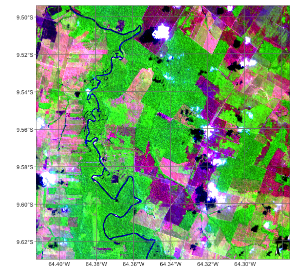
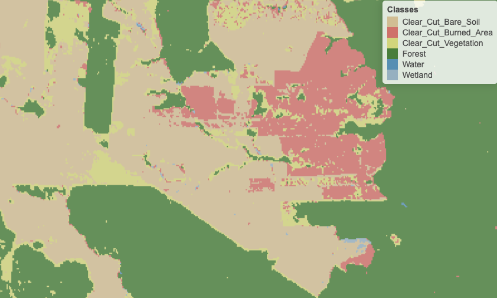
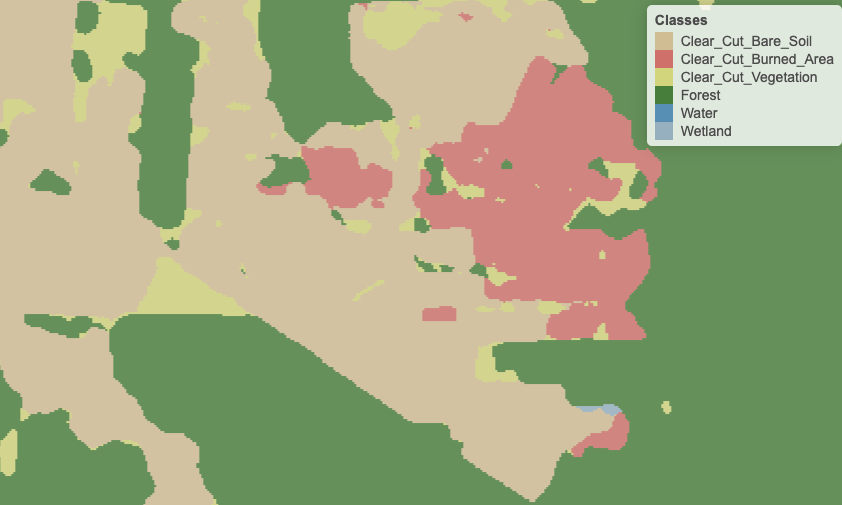

```{r, setup, include=FALSE, echo = FALSE}
options(prompt = 'R> ', continue = '+ ')
options(warn = -1)
# if terra is not installed, install it
if (!requireNamespace("terra", quietly = TRUE))
    install.packages("terra", repos = "https://cloud.r-project.org/")
library(terra)
# if bayesEO is not installed, install it
if (!requireNamespace("bayesEO", quietly = TRUE))
    devtools::install_github("e-sensing/bayesEO")
library(bayesEO)
# if sitsdata is not installed, get it
if (!requireNamespace("sitsdata", quietly = TRUE))
    devtools::install_github("e-sensing/sitsdata")
library(sitsdata)
knitr::opts_chunk$set(echo = TRUE, fig.pos = "h")
knitr::opts_chunk$set(message = FALSE)
knitr::opts_chunk$set(warning = FALSE)
tempdir = "./temp_dir"
```
\newpage
# Introduction

The use of remote sensing images is essential for environmental management. Satellite images have a wide range of applications, including measuring changes in land cover and assessing agriculture and natural habitats. Satellite measurements are the only viable mean to repeatedely survey vast regions, such as tropical forests and the polar regions. Additionally, remote sensing data plays a critical role in protecting the environment by supplying essential information to policymakers and conservationists. 

Image classification is a key component of remote sensing image analysis. The goal of this task is to classify the pixels in an image into different categories based on their spectral characteristics, spatial patterns, or other pertinent features. Researchers employ machine learning methods like random forests \citep{Belgiu2016} and deep learning \citep{Ma2019} for image classification. The output of machine learning classifiers is a set of class probabilities for each pixel, organised in matrices that are identical in size to the original image. Each matrix provides the probability of a pixel’s class membership. These matrices are the input to post-processing techniques that aim at refining the machine learning results. Post-processing leads to improved accuracy and better interpretability of the final output by reducing errors and minimizing noise \citep{Schindler2012}.

Due to the complexity of remote sensing data, classification algorithms may inadvertently introduce noise or produce outliers. In medium-resolution satellite images, such as Landsat or Sentinel-2, pixels frequently display mixed spectral responses from different land cover types. Consequently, classification outcomes often contain misclassified pixels, particularly at the boundaries of two homogenous ground objects with distinct spectral characteristics. The aim of post-processing is to detect and rectify such inaccuracies, ensuring more accurate classification results.

The fragment of a Sentinel-2 image from in Rondonia, Brazil, shown in Figure \@ref(fig:roim), illustrates why post-processing is required for image classification. In the image, one can see the distinction between green forest areas and deforested areas depicted in shades of orange and brown. \textcolor{red}{Um ponto importante pois é o main pitch para vender o paper na Introdução: 
Não sei se é daltonismo mas não vejo na Figura 1 pixels "in shades of orange and brown."
è dito na introdução: " between green forest areas and deforested areas depicted in shades of orange and brown." Vejo apenas verde, rosa e purple.}. The border pixels between green forest areas and brown bare soil have mixed responses. In many cases, such mixed pixels will be labelled as a third class which does not occur in this area. Thus, these border pixels are prone to misclassification, which needs to be corrected using suitable post-processing methods. \textcolor{red}{Talvez circular com um desenho feito a mao as regioes 
problematicas possa ser util.}

```{r roim, echo = FALSE, out.width="80%",  fig.align="center", fig.cap= "Detail of Sentinel-2 image in the Amazon forest."}
# select a directory with images of Amazonia

```

Image classification post-processing methods include Gaussian, semi-global, bilateral, and edge-aware filtering \citep{Schindler2012}, modal filters \citep{Ghimire2010}, and co-occurrence matrices \citep{Huang2014}. All these methods have limitations to deal with boundary pixels. Both Gaussian and semi-global smoothing methods assume that each class has a uniform local variance value. These approaches assume probabilities change gradually within a window centred on each pixel, which is not the case for border pixels. As a result, these methods blur the crisp boundaries that separate homogenous regions in the image. Gaussian and semi-global smoothing techniques are ineffective in addressing the problem of mixed pixels at object boundaries \citep{Huang2014}. Bilateral smoothing uses two global parameters to maintain boundary shapes \citep{Schindler2012}. The algorithm assumes that the spatial distribution of the class probabilities is isotropic in a pixel's neighbourhood. As we argue in this paper, such an assumption does not hold for border pixels. Hence, there is a need for post-processing methods that can handle situations involving mixed pixels and anisotropic neighborhoods.

The paper introduces a new post-processing algorithm for remote sensing image classification using an Empirical Bayes approach. The algorithm is available in the R package \pkg{bayesEO}. To simulate the impact of discontinuity between land classes, we use non-isotropic neighborhood definitions. \textcolor{red}{Sugestao para a ultima sentenca: To represent empirically observed patterns in regions between land classes, we utilize non-isotropic neighborhood definitions}. Our method allows the inclusion of expert knowledge to enhance the consistency of the resulting map. The \pkg{bayesEO} package can be combined with \pkg{sits}, an end-to-end toolkit for land use and land cover classification using big Earth observation data developed by the authors \citep{Simoes2021}.

Our package adds to other \proglang{R} libraries focused on the spatial data analysis, including \pkg{spdep} \citep{Bivand2023} and \pkg{rgeoda} \citep{Li2022}. \pkg{CARBayes} \citep{Lee2013}  implements Bayesian models for spatial areal units. For image processing analysis,  \pkg{terra} \citep{Hijmans2023} provides supervised classification with decision trees, while \pkg{stars} \citep{Bivand2023} includes functions for linear regression and random forest classification. For post-processing of machine learning image classification, \pkg{sits} also uses the method described in this paper. As far as we know, no current \proglang{R} package supports post-processing of image classification of remote sensing images. Therefore, the \pkg{bayesEO} is a useful addition to the facilities available in \proglang{R} for remote sensing image processing. 

\newpage

# Methods

## The land classification problem

In land classification, we deal with categorical data, with each category corresponding to a different land type (e.g., forest, grassland, wetland, crop). Land classification aims to subdivide the space into discrete areas, each associated with a distinct type of land use or cover. Borders between different land classes usually represent sharp transitions. Formally, the land classification problem can be expressed as follows. Given a set of $n$ spatial locations or pixels $S = \{ \mathbf{s}_1, \ldots, \mathbf{s}_n \}$, each with an associated $d$-dimensional feature vector $\mathbf{x}_1, \ldots, \mathbf{x}_s$ with values in $\mathcal{X} \subset \mathbb{R}^d$, we seek a classification function $f$ 
mapping each pair $(\mathbf{s}_{i}, \mathbf{x}_{i})$ to $m$ land classes $K = \{ 1, ..., m \}$ probabilities: 

\begin{align}
f\colon (S, \mathcal{X}) & \longrightarrow K \nonumber \\
(\mathbf{s}_i, \mathbf{x}_i) & \longmapsto (p_{i,1}, \ldots, p_{i,m}) 
\label{eq:classificationf}
\end{align}

\textcolor{red}{The domain of f is not the cartesian product $(S \times \mathcal{X})$ because there is no point 
$( \mathbf{s}_i, \mathbf{x}_j )$ 
in the domain (when $i \neq j$). }

with $0 \leq p_{i,k} \leq 1$ and $\sum_k p_{i,k} = 1 ~ \forall i = 1, \ldots, n$. The value $p_{i,k}$ is interpreted as the probability that the $i$-th pixel belongs to the $k$-th class. The class assigned to the pixel is determined by the highest probability among the available options. 

For pixel-based classification methods, the spatial location $\mathbf{s}_i$ of the pixel is not explicitly used by the classification function $f$. The reason is that $f$ is obtained from a training dataset $T = \{ \mathbf{s}_{t_1}, \ldots, \mathbf{s}_{t_s} \} \subset S$ with $s \ll n$. Each element $\mathbf{s}_{t_i} \in T$ is coupled with one single label $k_{t_i} \in K$ representing the class to which it belongs, even when the pixel has mixed classes on the ground.  This training dataset is also called the \textit{ground truth} dataset. Usually, it is composed of non-contiguous locations and therefore, there is no spatial neighborhood context  available to train $f$. The only resource to fit $f$ are the true labels and the features $\mathbf{x}$ measured at each location in the training dataset $T$. 

```{r mapnosmooth, echo=FALSE, out.width="70%", fig.pos = "!h", fig.cap="Detail of labelled map produced by pixel-based random forest without smoothing (source: authors)",fig.align='center'}


```

The main idea behind our post-processing method is that a pixel-based classification should take into account its neighborhood pixels. Consider Figure \@ref(fig:mapnosmooth) which shows a class assignment produced by a random forest algorithm on an image time series in the area shown in Figure \@ref(fig:roim). The image time series has been classified using the \proglang{R} package \pkg{sits}[@Simoes2021]. 

The classified map has been produced by taking, for each pixel, the class of higher probability produced by the algorithm. The resulting map has many noisy areas with a high spatial variability of class assignments. This happens more frequently in two cases: (a) small clusters of pixels of one class inside a larger area of a different class; (b) transition zones between classes. In general, images of heterogeneous landscapes with high spatial variability have many mixed pixels, whose spectral response combines different types of land cover in a single ground resolved cell. For example, many pixels in the border between areas of classes \code{Forest} and \code{Clear_Cut_Bare_Soil} are wrongly assigned to the \code{Clear_Cut_Vegetation} class. This wrong assignment occurs because these pixels have a mixed response. Inside the ground cell captured by the sensor as a single pixel value, there are both trees and bare soil areas. Such results are undesirable and need to be corrected by post-processing.


To maintain consistency and coherence in our class representations, we should minimise small variations or misclassifications. We incorporate spatial coherence as a post-processing step to accomplish this. The probabilities associated with each pixel will change based on statistical inference, which depends on the values for each neighbourhood. Using the recalculated probabilities for each pixel, we get a better version of the final classified map.  

```{r mapsmooth, echo=FALSE, out.width="70%", fig.pos = "!h", fig.cap="Detail of labelled map produced by pixel-based random forest after smoothing (source: authors)", fig.align='center'}


```


Consider Figure \@ref(fig:mapsmooth), which is the result of Bayesian smoothing on the random forest algorithm outcomes. The noisy border pixels between two large areas of the same class have been removed. We have also removed small clusters of pixels belonging to one class inside larger areas of other classes. The outcome is a more uniform map, like the ones created through visual interpretation or object-based analysis. Details like narrow vegetation corridors or small forest roads might be missing in the smoothed image. However, the improved spatial consistency of the final map compensates for such losses, due to the removal of misclassified pixels that have mixed spectral responses.  


## A Bayesian approach to smooth image classification probabilities

We propose a Bayesian approach for post-processing of pixel probabilities. Let $\pi_{i,k} \geq 0$ be the prior probability of the $i$-th pixel belonging to class $k \in \{1, \ldots, m\}$. Converting probabilities to the logit scale allows for less modelling restrictions. Accordingly, let 

\begin{equation} 
\mu_{i,k} = \log\left( \frac{\pi_{i,k}}{1-\pi_{i,k}} \right) \sim N(m_{i,k}, s^2_{i,k}) 
\end{equation}
\textcolor{red}{Estava escrito $x_{i,k} = \log ...$}

The classification algorithm outputs the feature-based probabilities $(p_{i,1}, \ldots, p_{i,m})$ from (\ref{eq:classificationf}). We convert these observed values to the logit
scale and assume a Gaussian distribution conditionally on $\mu_{i,k}$: 
  $(x_{i,k}|\mu_{i,k}) = \log(p_{i,k}/(1-p_{i,k})) \sim N(\mu_{i,k}, \sigma^2_k)$. 
The variance $\sigma^2_{k}$ will be estimated based on user expertise and taken as a hyperparameter to control the smoothness of the resulting estimate.

The standard Bayesian updating \citep{Gelman2014} leads to the posterior distribution

\begin{equation}
(\mu_{i,k} | x_{i,k}) \sim \sum N\left(  \frac{m_{i,k} \sigma^2_{k} +
    x_{i,k} s^2_{i,k}}{ \sigma^2_{k} +s^2_{i,k}} , \left( \frac{1}{\sigma_k^2} + \frac{1}{s^2_{i,k}} \right)^{-1} \right) 
\label{eq:BayesUpdate}
\end{equation}
\textcolor{red}{ Havia um $\sum$ antes da $N(...)$ }

The standard Bayesian method obtains the posterior distributions for each class probability, and the pixel is assigned to the class with higher posterior mean. The posterior mean is a weighted average between the pixel value $x_{i,k}$  and the prior mean $m_{i,k}$. When the prior variance $s^2_{i,k}$  is high, the algorithm assigns more weight to the pixel value $x_{i,k}$. Conversely, as the likelihood variance $\sigma^2_k$ increases, the method assigns more weight to the prior mean $m_{i,k}$.

The fundamental idea behind Bayesian smoothing for land classification posits that image patches with similar characteristics usually have a dominant class. This dominant class has higher average probabilities and lower variance than other classes. A pixel assigned \textcolor{red}{ wrongly assigned?? misassigned??} to a different class will likely exhibit lower average probabilities and higher local variance in such regions. As a result, post-processing should adjust the class of this pixel to match the dominant class.

There is usually no prior information to specify $m_{i,k}$ and $s^2_{i,k}$. Because of that, we adopt an Empirical Bayes (EB) approach to obtain estimates of these prior parameters by considering the pixel neighborhood. However, using a standard symmetrical neighborhood for each pixel, based uniquely on the distance between locations, would not produce reasonable results for border pixels. For this reason, our EB estimates uses non-isotropic neighborhood, as explained below.

## Empirical Bayes statistics using anisotropic neighbourhoods

Classification challenges arise for pixels located along the boundaries between areas containing different classes, 
as they exhibit characteristics of two or more classes simultaneously. In such cases, only a subset of the neighbors surrounding these boundary pixels belongs to the same class. To tackle this issue, we employ a non-isotropic definition of neighborhood to estimate the prior class distribution.

Pixels in the border between two areas of different classes pose a challenge. Only some of their neighbors belong to the same class as the pixel. Consider a boundary pixel with a neighborhood defined by a 7 x 7 window, located along the border between the \code{Forest} and \code{Grassland} classes. To estimate the prior probability of the pixel being a \code{Forest}, we should only take into account the neighbours on one side of the border that are likely to be correctly classified as \code{Forest}. Pixels on the opposite side of the border should be disregarded, since they are unlikely to belong to the same spatial process. In practice, we use only half of the pixels in the 7 x 7 window, opting for those that have a higher probability of being \code{Forest}. For the prior probability of the \code{Grassland} class, we reverse the selection and only consider those on the opposite side of the border.

Although this choice of neighbourhood may seem unconventional, it is consistent with the assumption of non-continuity of the spatial processes describing each class. A dense forest patch, for example, will have pixels with strong spatial autocorrelation for values of the \code{Forest} class; however, this spatial autocorrelation doesn't extend across its border with other land classes.

Thus, the EB estimates uses specific neighbourhoods $\mathcal{N}_{i,k}$ for each class $k$ and pixel $i$. We use an $L$-statistic to estimate $m_{i,k}$ and $s^2_{i,k}$ in our EB approach. Let $\alpha \in (0, 1)$ and $W_{i}$ be the set of $w$ nearest neighbors of pixel $i$ (excluding the $i$-th pixel itself).  Also, let $\mathbb{F}_{i,k}$ be the empirical distribution of the $x_{j,k}$ for $j \in W_i$.
Then, we take 

\begin{equation}
\hat{m}_{i,k} = \frac{1}{1-\alpha} \int_{\alpha}^{\infty} \mathbb{F}_{i,k}^{-1}(s) ~ ds \: , 
\end{equation}

the average of the largest $(1-\alpha)$-th fraction order statistics of the $p_{i,k}$ logit transformed observations. Likewise, based on the these same $(1-\alpha)$-th subset, we obtain an empirical estimate $\hat{s}^2_{i,k}$. The values of $\hat{m}_{i,k}$ and $\hat{s}^2_{i,k}$ are used in the Bayesian updating (cf Equation \ref{eq:BayesUpdate}). 

## Effect of the hyperparameter

The parameter $\sigma^2_k$ controls the level of smoothness. If $\sigma^2_k$ is zero, the estimated value ${E}[\mu_{i,k} | x_{i,k}]$ will be the pixel value $x_{i,k}$. Values of the likelihood variance $\sigma^2_{k}$, which are small relative to the prior variance $s^2_{i,k}$ increase our confidence in the original probabilities. Conversely, likelihood variances $\sigma^2_{k}$, which are large relative to the prior variance $s^2_{i,k}$, increase our confidence in the average probability of the neighborhood.

Thus, the parameter $\sigma^2_{k}$ expresses confidence in the inherent variability of the distribution of values of a class $k$. The smaller the parameter $\sigma^2_{k}$, the more we trust the estimated probability values produced by the classifier for class $k$. 
Conversely, higher values of $\sigma^2_{k}$ indicate lower confidence in the classifier outputs and improved confidence in the local average values.

Consider the following two-class example. Take a pixel $i$ with probability $0.4$ (logit $x_{i,1} = -0.4054$) for class A, and probability $0.6$ (logit $x_{i,2} = 0.4054$) for class B. Without post-processing, the pixel will be labelled as class B. Consider a local average of $0.6$ (logit $m_{i,1} = 0.4054$) for class A and $0.4$ (logit $m_{i,2} = -0.4054$) for class B. This is an outlier classified as class B in the midst of a set of pixels of class A. 

Given this situation, we apply the proposed method. Suppose the local variance of logits to be $s^2_{i,1} = 5$ for class A and $s^2_{i,2} = 10$ and for class B. This difference is to be expected if the local variability of class A is smaller than that of class B. To complete the estimate, we need to set the parameter $\sigma^2_{k}$, representing our belief in the variability of the probability values for each class. 

Setting $\sigma^2_{k}$ will be based on our confidence in the local variability of each class around pixel ${i}$. If we considered the local variability to be high, we can take both  $\sigma^2_1$ for class A and $\sigma^2_2$ for class B to be both 10. In this case, the Bayesian  estimated probability for class A is $0.52$  and for class B is $0.48$ and the pixel will be relabelled as being class A. 

By contrast, if we consider local variability to be high If we set $\sigma^2$ to be 5 for both classes A and B, the Bayesian probability estimate will be $0.48$ for class A and $0.52$ for class B. In this case, the original class will be kept. Therefore, the result is sensitive to the subjective choice of the hyperparameter.


# Software and examples

## The BayesEO package

The post-processing method described in this paper is implemented in the \proglang{R} \pkg{bayesEO}, which is available on CRAN and also on github. The examples below also require installation of package \pkg{sitsdata}. Because of its size, they cannot be loaded into CRAN; it has to be obtained directly for its github repository, The code below retrieves and loads \pkg{bayesEO} and \pkg{sitsdata}.

```{r, echo = TRUE, eval = FALSE}
# configuration 
# if bayesEO is not installed, install it
if (!requireNamespace("bayesEO", quietly = TRUE))
    devtools::install_github("e-sensing/bayesEO")
library(bayesEO)
# if sitsdata is not installed, get it
if (!requireNamespace("sitsdata", quietly = TRUE))
    devtools::install_github("e-sensing/sitsdata")
library(sitsdata)
```

## Reading a probability data cube
 
The input for post-classification is an image with probabilities produced by a machine learning algorithm. This image should be a single file with multiple bands, where each band contains the pixel probabilities of a single class. In the examples, we use a file produced by a random forest algorithm applied to a data cube of Sentinel-2 images for tile "20LLQ" in the period 2020-06-04 to 2021-08-26. The file uses an INT2S data type with integer values between [0..10000] to represent probabilities ranging from 0 ro 1. 

The training data has six classes: (a) \code{Forest} for natural tropical forest; (b) \code{Water} for lakes and rivers; (c) \code{Wetlands} for areas where water covers the soil in the wet season; (d) \code{ClearCut_Burn} for areas where fires cleared the land after tree removal; (e) \code{ClearCut_Soil} where the forest has been completely removed; (f) \code{ClearCut_Veg} where some vegetation remains after most trees have been removed. 

To read the probability image, we use the function \code{bayes_read_probs()} whose parameters are an image file with probabilities and a set of labels. The probability image can be viewed using \code{bayes_plot_probs()}. The function \code{bayes_label()} takes the probability image as an input and produces a categorical map which associates each pixel with the class of highest probability.The map is rendered using \code{bayes_plot_map()}.

```{r pcube, width = 5, tidy="styler", fig.align = 'center', fig.cap = "Class probabilities produced by random forest algorithm"}
# select the file containing the class probability
data_dir <- system.file("/extdata/Rondonia-20LLQ/", package = "sitsdata")
probs_file <- paste0(data_dir, 
                     "SENTINEL-2_MSI_20LLQ_2020-06-04_2021-08-26_probs_v1.tif")
# set the labels
labels <- c("Water", "ClearCut_Burn", "ClearCut_Soil",
            "ClearCut_Veg", "Forest", "Wetland")
# read the probability image 
probs_image <- bayes_read_probs(probs_file, labels)
# plot the probabilities for classes Forest and ClearCut_Soil
bayes_plot_probs(probs_image, labels = c("Forest", "ClearCut_Soil", 
                                         "ClearCut_Veg", "ClearCut_Burn"))
```

Figure \@ref(fig:pcube) shows the plot of the probability images for classes \code{Forest}, \code{ClearCut_Soil}, \code{ClearCut_Veg} and \code{ClearCut_Burn}. The map for class \code{Forest} shows high probability values associated with compact patches. Even inside relatively homogenous areas, there are locations whose probabilities vary significantly. There is large variation in areas close to the river that runs from South to North, corresponding to riparian forest of lower density.  Class \code{ClearCut_Soil} is mostly composed of dense areas of high probability whose geometrical boundaries result from forest cuts. Some of the patches of this class, as those in the upper-left corner, have high variation in their probabilities. The class \code{ClearCut_Veg} is less well-defined than the others; this is to be expected since this is a transitional class between a natural forest and areas of bare soil. Patches associated to class \code{ClearCut_Brun} include both homogeneous areas of high probability and areas of mixed response. Overall, there are many areas with mixed responses, which highlight the value of spatial smoothing.

```{r map1, tidy = "styler", echo=TRUE, eval=TRUE, fig.width = 5, fig.align = 'center', fig.cap = "Labelled map without smoothing."}
# produce a labelled map
map_no_smooth <- bayes_label(probs_image)
# show the map
bayes_plot_map(map_no_smooth)
```

Figure \@ref(fig:map1) shows the classification map, obtained by taking the class of higher probability to each pixel, without considering the spatial context. The non-smoothed labelled map shows the need for post-processing, since it contains a significant number of outliers and areas with mixed labelling. 

## Estimating the local logit variances

The local logit variances correspond to the $s^2_{i,k}$ parameter in the Bayesian inference and are estimated by \code{bayes_variance()}. Its main parameters are: (a) a \code{SpatRaster}  object ; (b) \code{window_size}, dimension of the local neighbourhood; (c) \code{neigh_fraction}, the percentage of pixels in the neighbourhood used to calculate the variance. The example below uses half of the pixels of a $7\times 7$ window to estimate the variance. The chosen pixels will be those with the highest probability pixels to be more representative of the actual class distribution. The output values are the logit variances in the vicinity of each pixel. 

```{r, echo=TRUE, eval=TRUE}
var_image <- bayes_variance(
    x = probs_image,
    window_size = 7,
    neigh_fraction = 0.50)
bayes_summary(var_image)
```

The choice of the $7 \times 7$ window size is a compromise between having enough values to  estimate the parameters of a normal distribution and the need to capture local effects  for class patches of small sizes. Classes such as \code{Water} and \code{ClearCut_Burn} tend to be spatially limited; a bigger window size could result in invalid values for their respective normal distributions.

The summary statistics show that most local variance values are low, which is an expected result. Areas of low variance correspond to pixel neighborhoods of high logit values for one of the classes and low logit values for the others. High values of the local variances are relevant in areas of confusion between classes. Figure \@ref(fig:vcube) shows the values of local logit variances for classes \code{ClearCut_Soil} and \code{Forest}, considering only the $4^{th}$ quartile of the distribution. Only the top 25% of the values for each class are shown, emphasizing areas of high local variability. 

```{r vcube, fig.width = 8, tidy="styler", fig.align = 'center', fig.cap = "Logit variance map showing values above the 3rd quartile for classes ClearCutVeg and Forest."}
bayes_plot_var(var_image, 
                 quantile = 0.75, 
                 palette = "Greens",
                 labels = c("ClearCut_Veg", "Forest"))
```

Comparing the logit variance maps of Figure \@ref(fig:vcube) with the probability maps of Figure \@ref(fig:pcube) emphasizes the relevance of expert knowledge. The areas of high probability of class \code{Forest} are mostly made of compact patches. However, there are areas of high local variance inside these patches, due to natural variation of the forest and also resulting from forest degradation. By contrast, class \code{ClearCut_Veg} represents a transition between natural forest areas and places where all trees have been cut, which are associated to class \code{ClearCut_Soil}. Class \code{ClearCut_Veg} has a high spectral variability, since the extent of remaining vegetation after most trees have been removed is not uniform. For this reason, many areas of high local variance of class \code{ClearCut_Veg} are located in the borders between homogenous areas.

## Applying Bayesian smoothing to remove outliers

As discussed above, the effect of the Bayesian estimator depends on the values of the a priori variance $\sigma^2_{k}$ set by the user and the neighbourhood definition to compute the local variance $s^2_{i,1}$ for each pixel. We set $\sigma^2$ values for each class by considering values in the 4th quartile, close to the maximum local logit variance for each class. To remove the outliers in the classification map, \pkg{bayesEO} provides \code{bayes_smooth()}. Its main parameters are: (a) \code{x}, a probability image; (b) \code{window_size},  dimension of the local neighbourhood; (c) \code{smoothness}, prior logit variances for each class. 

```{r, echo=TRUE, eval=TRUE}
smooth_probs <- bayes_smooth(
    probs_image,
    window_size = 7,
    smoothness = c(
      "Water" = 15, "ClearCut_Burn" = 5, "ClearCut_Soil" = 6, 
      "ClearCut_Veg" =  8, "Forest" = 10, "Wetland" = 5)
)
```

The impact of Bayesian smoothing can be best captured by producing a labelled map using \code{bayes_label()}, taking the smoothed image as its input. Figure \@ref(fig:smth1) shows that the outliers and isolated pixels have been removed.

```{r smth1, fig.width = 5, fig.align = 'center', fig.cap = "Labeled map with Bayesian  smoothing."}
map_smooth_bayes <- bayes_label(smooth_probs)
bayes_plot_map(map_smooth_bayes)
```

In the smoothed map, the outliers have been removed by expanding \code{Forest} areas. Forests have replaced small corridors of water and soil encircled by trees. This effect is due to the high probability of forest detection in the training data. To better assert the impact of smoothing, consider the class areas in the non-smoothed and smoothed maps.

```{r, echo=TRUE, eval=TRUE}
# get the summary of the non-smoothed map
sum1 <- bayes_summary(map_no_smooth)
colnames(sum1) <- c("class", "area_k2_no_smooth")
# get the summary of the smoothed map
sum2 <- bayes_summary(map_smooth_bayes)
colnames(sum2) <- c("class", "area_k2_smooth")
# compare class areas of non-smoothed and smoothed maps
dplyr::inner_join(sum1, sum2, by = "class")
```

## Relevance of expert knowledge in Bayesian inference

In the smoothed map (Figure \@ref(fig:smth1)), the most frequent classes (\code{ClearCut_Soil} and \code{Forest}) increased their areas at the expense of the others. As shown in Figure \@ref(fig:pcube), these classes occur in more compact patches than the others.  Based on the experience of the authors with different experts on land use classification, there are two main approaches for setting the $\sigma^2_{k}$ parameter:
    
1. Increase the neighborhood influence compared with the probability values for each pixel, setting high values (20 or above) to $\sigma^2_{k}$ and increasing the neighborhood window size. Classes whose probabilities have strong spatial autocorrelation will tend to replace outliers.

2. Reduce the neighborhood influence compared with the probabilities for each pixel of class $k$, setting low values (five or less) to $\sigma^2_{k}$. In this way, classes with low spatial autocorrelation are more likely to keep their original labels.

Consider the case of forest areas and watersheds. If an expert wishes to have compact areas classified as forests without many outliers inside them, she will set the $\sigma^2$ parameter for the class  \code{Forest} to be high. For comparison, to avoid that small watersheds with few similar neighbors being relabeled, it is advisable to avoid a strong influence of the neighbors, setting $\sigma^2$ to be as low as possible. Therefore, the choice of $\sigma^2$ depends on the effect intended by the expert in the final classified map. 

<!--
PEDRO: Eu poderia usar o filtro bayesiano para as situacoes abaixo? Ou isto ficaria a cargo apenas da classificacao?
1) Computar um "intervalo de confianca" para o total de cada classe de uso da terra para cada ano. a depender do estudo posterior que for realizado com os dados de uso da terra esse intervalo pode ser considerado, verificando se ele pode ter algum efeito significativo no resultado final ou nao.

2) Maximizar/minimizar a area uma determinada classe em detrimento de outras. Por exemplo, suponha que eu queira fazer um PRODES usando o sits. Eu poderia maximizar as areas de desmatamento, minimizando falsos negativos. Assim, um especialista poderia fazer uma validacao visual em cima das areas indicadas como desmatamento resultantes do sits, ao inves de ter que olhar toda a area fora da mascara, como e' feito hoje.
-->

# Comparison with other methods 

To better understand the benefits of Bayesian smoothing, in this section we present the results of post-processing using two alternatives: Gaussian smoothing and bilateral smoothing. Gaussian smoothing is a low-pass filter where the weights are based on the normal distribution. Pixels near the center of the kernel have a higher weight, and the weight decreases for pixels further away from the center. This creates a blurring effect that is stronger at the center and weaker at the edges. The extent of smoothing is controlled by the standard deviation of a Gaussian distribution. The convolution operation effectively averages pixel values in the neighborhood defined by the kernel, with weights given by the Gaussian distribution. This results in a reduction of high-frequency noise and a blurring effect. 

The Gaussian Kernel is expressed as
\begin{equation}
   G(x, y) = \frac{1}{2\pi\sigma^2} e^{-\frac{x^2 + y^2}{2\sigma^2}}
\end{equation}
   where $\sigma$ is the standard deviation of the Gaussian distribution. The convolution for Gaussian smoothing is expressed as 

\begin{equation}
   I'(x, y) = \sum_{i=-k}^{k} \sum_{j=-k}^{k} G(i, j) \cdot I(x - i, y - j)
\end{equation}

In this equation, $I'(x, y)$ represents the smoothed image, $I(x, y)$ is the original image, $G(i, j)$ is the Gaussian kernel, and $(i,j)$ are the indices running over the kernel size, typically centered around zero. The following code computes a Gaussian smoothing filter, labels the image and plots the resulting map. 

```{r gauss, fig.width = 5, fig.align = 'center', fig.cap = "Labeled map using Gaussian smoothing."} 
# compute Gaussian smoothing, label and plot map
gaussian_smooth(probs_image, window_size = 7, sigma = 5 ) |> 
  bayes_label() |> 
  bayes_plot_map()
```

Comparison between Figure \@ref(fig:smth1) and Figure \@ref(fig:gauss) shows subtle but important differences. Bayesian smoothing does a better job of preserving edges and small homogeneous areas than Gaussian filtering. The result is a more consistent map. Parameters for Gaussian smoothing are the same for each class and assume isotropic neighbourhoods, while Bayesian inference allows the expert to control the output. Moreover, the parameter $\sigma$ for Gaussian filtering was set by trial-and-error. The above example shows the best result after trying different alternatives. 

Bilateral smoothing aims to reduce noise while preserving edges. Unlike the Gaussian filter, which can blur edges, the bilateral filter maintains sharp edges by taking into account the difference in intensity values between pixels [@Tomasi1998].  Bilateral filtering combines a spatial filter, like the Gaussian filter, which considers the spatial closeness of pixels, with a range filter, which considers the similarity in intensity values between pixels. By considering intensity differences, the bilateral filter can preserve edges. 

The bilateral filter has two main parameters: (a) the spatial parameter $\sigma$  controls the spatial extent of the kernel; (b) the range parameter $\tau$ controls how much a pixel must differ in intensity for it to be considered different. Its mathematical expression is

\begin{equation}
I'(x, y) = \frac{1}{W(x, y)} \sum_{i=-k}^{k} \sum_{j=-k}^{k} I(x - i, y - j) \cdot G_{\sigma}(i, j) \cdot G_{\tau}(I(x - i, y - j) - I(x, y))
\end{equation}

where $I'(x,y)$ is the filtered image and $I(x,y)$ is the original image. $G_{\sigma}(i, j)$ is the spatial Gaussian function, which decreases with distance from the central pixel, controlled by the spatial standard deviation $\sigma$. $G_{\tau}(I(x + i, y + j) - I(x, y))$ is the range Gaussian function, which decreases with the intensity difference between the neighboring pixel and the central pixel controlled by the range standard deviation $\tau$.

$W(x, y)$ is a normalization factor defined as 
\begin{equation}
W(x, y) = \sum_{i=-k}^{k} \sum_{j=-k}^{k} G_{\sigma_s}(i, j) \cdot G_{\sigma_r}(I(x - i, y - j) - I(x, y))
\end{equation}

This formula illustrates how the bilateral filter considers both spatial proximity and intensity similarity in its smoothing process, thereby preserving edges while reducing noise in other areas. The following code performs bilateral smoothing.

```{r bilat, fig.width = 5, fig.align = 'center', fig.cap = "Labeled map using bilateral smoothing."} 
# compute Gaussian smoothing
bilat_smooth <- bilateral_smooth(
    probs_image,
    window_size = 7,
    sigma = 5,
    tau = 2.0
)
# produce the labelled map
bilat_map <- bayes_label(bilat_smooth)
# plot the map produced by Bilateral smoothing
bayes_plot_map(bilat_map)

```

The resulting map after bilateral smoothing is similar to the output of Bayesian smoothing. However, this result required some rounds of trial and error to set the best values for the $\sigma$ and $\tau$ parameters. There is no objective method for choosing the appropriate values for them. By contrast, the smoothness parameters for Bayesian filtering are select based on the variances of the class probabilities. 

This example shows the value of the Bayesian inference procedure compared with smoothing methods such as Gaussian and edge-aware filtering \citep{Schindler2012}. Most post-classification procedures use ad-hoc parameters which are not directly linked to the properties of the data. These parameters are based on the structure of the algorithm (e.g, size of the Gaussian kernel), not being easily defined separately for each class. Bayesian inference allows the expert to control the output and to set the parameters based on objective criteria.

# Using smoothing in connection with time-first, space-later methods

Time-first, space-later is a concept in satellite image classification that takes time series analysis as the first step for analysing remote sensing data, with spatial information being considered after all time series are classified \citep{Camara2016}.  Satellite image time series are calibrated and comparable measures of the same location on Earth at different times. When associated with frequent revisits, image time series can capture significant land use and land cover changes. Detecting and tracking seasonal and long-term trends becomes feasible, as well as identifying anomalous events or patterns in the data, such as wildfires, floods, or droughts \cite{Woodcock2020}. 

This approach takes image time series as the first step for analysing remote sensing data. The \textit{time-first} part brings a better understanding of changes in landscapes. Detecting and tracking seasonal and long-term trends becomes feasible, as well as identifying anomalous events or patterns in the data, such as wildfires, floods, or droughts. Each pixel in a data cube is treated as a time series, using information available in the temporal instances of the case. Time series classification is pixel-based, producing a set of labeled pixels. This result is then used as input to the \textit{space-later} part of the method. In this phase, Bayesian algorithm improves the results of time-first classification by considering the spatial neighbourhood of each pixel. The resulting map thus combines both spatial and temporal information.

In \proglang{R}, the \pkg{sits} package combines machine learning methods for time series classification with spatial-based smoothing\citep{Simoes2021}. It has been used for large-scale land use classification in Brazil \cite{Picoli2018}. A recent comparative study shows that image time series classification with spatial smoothing achieves better results than purely spatial-based methods\citep{Hadi2023}. Thus, Bayesian smoothing is a key component of the time-first, space-later Earth observation data analysis.

# Conclusion

This paper presents a new method for post-processing of Earth observation images that have been classified using machine learning algorithms. Unlike ad-hoc smoothing methods avaliable in the literature, the proposed algorithm relies on objective metrics of class probability variance. We propose an Empirical Bayes approach to post-processing, which has a sound mathematical basis. The method has been validated for large-scale data analysis in connection with a time-first, space-based approach and represents a worthy alternative to other post-processing methods available in the literature. 

## Acknowledgments{-}

The authors acknowledge the support of the following institutions: (a) Amazon Fund, established by Brazil with financial contribution from Norway, through contract 17.2.0536.1.; (b) International Climate Initiative of the Germany Federal Ministry for the Environment, Nature Conservation, Building and Nuclear Safety (IKI) under grant 17-III-084-Global-A-RESTORE+ (“RESTORE+: Addressing Landscape Restoration on Degraded Land in Indonesia and Brazil”); (c) Microsoft Planetary Computer initiative under the GEO-Microsoft Cloud Computer Grants Programme; (d)
 Instituto Clima e Sociedade, under the project grant "Modernization of PRODES and DETER Amazon monitoring systems" (grants G-22-01193 and G-23-01643); (e) Open-Earth-Monitor Cyberinfrastructure project, under European Commission grant agreement No. 101059548.