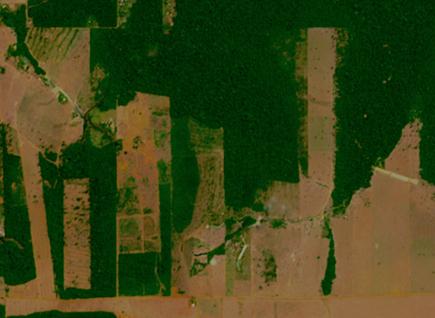

```{r, setup, include=FALSE, echo = FALSE}
options(prompt = 'R> ', continue = '+ ')
options(warn = -1)
# if terra is not installed, install it
if (!requireNamespace("terra", quietly = TRUE))
    install.packages("terra", repos = "https://cloud.r-project.org/")
library(terra)
# if bayesEO is not installed, install it
if (!requireNamespace("bayesEO", quietly = TRUE))
    devtools::install_github("e-sensing/bayesEO")
library(bayesEO)
# if sitsdata is not installed, get it
if (!requireNamespace("sitsdata", quietly = TRUE))
    devtools::install_github("e-sensing/sitsdata")
library(sitsdata)
knitr::opts_chunk$set(echo = TRUE, fig.pos = "h")
knitr::opts_chunk$set(message = FALSE)
knitr::opts_chunk$set(warning = FALSE)
tempdir = "./temp_dir"
```
\newpage
# Introduction

The use of remote sensing images is essential for environmental management. Satellite images have a wide range of applications, including measuring changes in land cover and assessing agriculture and natural habitats. Satellite measurements are the only viable mean to repeatedely survey vast regions, such tropical forests and the polar regions. Remote sensing data plays a critical role in protecting the environment by supplying essential information to policymakers and conservationists. 

Image classification is an key component of remote sensing image analysis. The goal of this task is to categorize the pixels in an image into different classes based on their spectral characteristics, spatial patterns, or other relevant features. Researchers employ machine learning methods like random forests \citep{Belgiu2016} and deep learning \citep{Ma2019} in image classification. The result of machine learning classifiers is a set of class probabilities for each pixel, organised in matrices that are identical in size to the original image. Each matrix provides the probability of a pixel’s class membership. These matrices are the input to post-processing techniques that aim to improve on the machine learning results. Post-processing leads to improved accuracy and better interpretability of the final output by reducing errors and minimizing noise \citep{Schindler2012}.

Due to the complexity of remote sensing data, classification algorithms can introduce noise or produce outliers. Spectral responses of ground targets have large variability. Pixels in medium-resolution satellite images, like Landsat or Sentinel-2, often have mixed spectral responses from different land cover types. For these reasons, classifiers produce results that include misclassified pixels, especially in the boundaries between two homogenous ground objects which have different spectral responses. Post-processing methods need to be able to detect and correct such errors.

The fragment of a Sentinel-2 image from the Amazon in Rondonia, Brazil, shown in Figure \@ref(fig:roim), illustrates why post-processing is required for image classification. In the image, one can see the distinction between green forest areas and deforested areas depicted in shades of orange and brown. The border pixels between green forest areas and brown bare soil have mixed responses. In many cases, such mixed pixels will be labelled as a third class which does not occur in this area. Thus, these border pixels are prone to misclassification, which needs to be corrected using suitable post-processing methods. 

```{r roim, echo = FALSE, out.width="70%",  fig.align="center", fig.cap= "Detail of Sentinel-2 image of deforestation in the Amazon forest (source: Sentinel Hub)."}


```

Image classification post-processing methods include Gaussian, semi-global, bilateral, and edge-aware filtering \citep{Schindler2012}, modal filters \citep{Ghimire2010}, and co-occurrence matrices \citep{Huang2014}. All these methods have limitations to deal with boundary pixels. Both Gaussian and semi-global smoothing methods assume that each class has a uniform local variance value. These approaches assume probabilities change gradually within a window centred on each pixel, which is not the case for border pixels. As a result, these methods blur the crisp boundaries that separate homogenous regions in the image. Gaussian and semi-global smoothing techniques are ineffective in addressing the problem of mixed pixels at object boundaries \citep{Huang2014}. Bilateral smoothing uses two global parameters to maintain boundary shapes \citep{Schindler2012}. The algorithm assumes that the spatial distribution of the class probabilities is isotropic in a pixel's neighbourhood. As we argue in this paper, such an assumption does not hold for border pixels. Hence, there is a need for post-processing methods that can handle situations involving mixed pixels and anisotropic neighborhoods.

The paper introduces a new post-processing algorithm for remote sensing image classification using an Empirical Bayes approach. The algorithm is available in the R package \pkg{bayesEO}. To simulate the impact of discontinuity between land classes, we use non-isotropic neighborhood definitions. Our method allows the inclusion of expert knowledge to enhance the consistency of the resulting map. The \pkg{bayesEO} package can be combined with \pkg{sits}, an end-to-end toolkit for land use and land cover classification using big Earth observation data developed by the authors \citep{Simoes2021}.

Our package adds to other \proglang{R} libraries focused on the spatial data analysis, including \pkg{spdep} \citep{Bivand2023} and \pkg{rgeoda} \citep{Li2022}. \pkg{CARBayes} \citep{Lee2013}  implements Bayesian models for spatial areal units. For image processing analysis,  \pkg{terra} \citep{Hijmans2023} provides supervised classification with decision trees, while \pkg{stars} \citep{Bivand2023} includes functions for linear regression and random forest classification. For post-processing of machine learning image classification, \pkg{sits} also uses the method described in this paper. As far as we know, no current \proglang{R} package supports post-processing of image classification of remote sensing images. Therefore, the \pkg{bayesEO} is a useful addition to the facilities available in \proglang{R} for remote sensing image processing. 


# Methods

## The land classification problem

In land classification, we deal with categorical data, with each category corresponding to a different land type (e.g., forest, grassland, wetland, crop). Land classification aims to subdivide the space into discrete areas, each associated with a distinct type of land use or cover. Borders between different land classes usually represent sharp transitions. Formally, the land classification problem can be expressed as follows. Given a set of $n$ spatial locations or pixels $S = \{ \mathbf{s}_1, \ldots, \mathbf{s}_n \}$, each with an associated $d$-dimensional feature vector $\mathbf{x}_1, \ldots, \mathbf{x}_s$ with values in $\mathcal{X} \subset \mathbb{R}^m$ and a set of $m$ land classes $K = \{ 1, ..., m \}$, we seek a classification function $f$ such that

\begin{align}
f\colon S \times \mathcal{X} & \longrightarrow K \nonumber \\
(\mathbf{s}_i, \mathbf{x}_i) & \longmapsto (p_{i,1}, \ldots, p_{i,m}) 
\label{eq:classificationf}
\end{align}

with $0 \leq p_{i,k} \leq 1$ and $\sum_k p_{i,k} = 1 \forall i = 1, \ldots, n$. The value $p_{i,k}$ is interpreted as the probability that the $i$-th pixel belongs to the $k$-th class. The class assigned to the pixel is determined by the highest probability among the available options. 

For pixel-based classification methods the spatial $\mathbf{s}_i$ dimension is not explicitly used by the classification function $f$. The reason is that $f$ is obtained from a training dataset $T = \{ \mathbf{s}_{t_1}, \ldots, \mathbf{s}_{t_s} \} \subset S$ with $s \ll n$. Each element $\mathbf{s}_{t_i} \in T$ is coupled with one single label $k_{t_i} \in K$ representing the class to which it belongs, even when the pixel has mixed classes on the ground.  This training dataset is also called the \textit{ground truth} dataset. Usually, it is composed of non-contiguous locations and therefore, there is no spatial neighborhood context  available to train $f$. The only resource to fit $f$ are the true labels features $\mathbf{x}$ measured at each location in the training dataset $T$. 

```{r mapnosmooth, echo=FALSE, out.width="70%", fig.pos = "!h", fig.cap="Detail of labelled map produced by pixel-based random forest without smoothing (source: authors)",fig.align='center'}

knitr::include_graphics("images/map_no_smooth_v2.png")
```

The main idea behind our post-processing method is that a pixel-based classification should take into account its neighborhood pixels. Consider Figure \@ref(fig:mapnosmooth) which shows a class assignment produced by a random forest algorithm. In this case, the resulting classified map has been produced by taking, for each pixel, the class of higher probability produced by the algorithm. The resulting map has many noisy areas with a high spatial variability of class assignments. This happens more frequently in two cases: (a) small clusters of pixels of one class inside a larger area of a different class; (b) transition zones between classes. In general, images of heterogeneous landscapes with high spatial variability have many mixed pixels, whose spectral response combines different types of land cover in a single ground resolved cell. For example, many pixels in the border between areas of classes \code{Forest} and \code{Clear_Cut_Bare_Soil} are wrongly assigned to the \code{Clear_Cut_Vegetation} class. This wrong assignment occurs because these pixels have a mixed response. Inside the ground cell captured by the sensor as a single pixel value, there are both trees and bare soil areas. Such results are undesirable and need to be corrected by post-processing.


To maintain consistency and coherence in our class representations, we should minimise small variations or misclassifications. We incorporate spatial coherence as a post-processing step to accomplish this. The probabilities associated with each pixel will change based on statistical inference, which depends on the values for each neighbourhood. Using the recalculated probabilities for each pixel, we get a better version of the final classified map.  

```{r mapsmooth, echo=FALSE, out.width="70%", fig.pos = "!h", fig.cap="Detail of labelled map produced by pixel-based random forest after smoothing (source: authors)", fig.align='center'}

knitr::include_graphics("images/map_smooth_v2.png")
```


Consider Figure \@ref(fig:mapsmooth), which is the result ofBayesian smoothing on the random forest algorithm outcomes. The noisy border pixels between two large areas of the same class have been removed. We have also removed small clusters of pixels belonging to one class inside larger areas of other classes. The outcome is a more uniform map, like the ones created through visual interpretation or object-based analysis. Details like narrow vegetation corridors or small forest roads might be missing in the smoothed image. However, the improved spatial consistency of the final map compensates for such losses, due to the removal of misclassified pixels that have mixed spectral responses.  


## A Bayesian approach to smooth image classification probabilities

We propose a Bayesian approach for post-processing of pixel probabilities. Let $\pi_{i,k} \geq 0$ be the prior probability of the $i$-th pixel belonging to class $k \in \{1, \ldots, m\}$. 
Converting probabilities to the logit scale allows for less modelling restrictions. Accordingly, let 

\begin{equation} 
\mu_{i,k} = \log\left( \frac{\pi_{i,k}}{1-\pi_{i,k}} \right) \sim N(m_{i,k}, s^2_{i,k}) 
\end{equation}

The classification algorithm outputs the feature-based probabilities $(p_{i,1}, \ldots, p_{i,m})$ from (\ref{eq:classificationf}). We convert these observed values to the logit
scale and assume a Gaussian distribution conditionally on $\mu_{i,k}$: 
  $x_{i,k} = \log(p_{i,k}/(1-p_{i,k})) \sim N(\mu_{i,k}, \sigma^2)$. 
The variance $\sigma^2_{k}$ will be estimated based on user expertise and taken as a hyperparameter to control the smoothness of the resulting estimate.

The standard Bayesian updating \citep{Gelman2014} leads to the posterior distribution

\begin{equation}
(\mu_{i,k} | x_{i,k}) \sim \sum N\left(  \frac{m_{i,k} \sigma^2_{k} +
    x_{i,k} s^2_{i,k}}{ \sigma^2_{k} +s^2_{i,k}} , \left( \frac{1}{\sigma_k^2} + \frac{1}{s^2_{i,k}} \right)^{-1} \right) 
\label{eq:BayesUpdate}
\end{equation}

The EB estimate calculates the posterior distributions for each class, and the pixel will be assigned to the class with higher posterior mean. The posterior mean is a weighted average between the pixel value $x_{i,k}$  and the prior mean $m_{i,k}$. When the prior variance $s^2_{i,k}$  is high, the algorithm assigns more weight to the pixel value $x_{i,k}$. Conversely, as the likelihood variance $\sigma^2_k$ increases, the method assigns more weight to the prior mean $m_{i,k}$.

The fundamental idea behind Bayesian smoothing for land classification posits that image patches with similar characteristics usually have a dominant class. This dominant class has higher average probabilities and lower variance than other classes. A pixel assigned to a different class will likely exhibit lower average probabilities and higher local variance in such regions. As a result, post-processing should adjust the class of this pixel to match the dominant class.

There is usually no prior information to specify $m_{i,k}$ and $s^2_{i,k}$. Because of that, we adopt an Empirical Bayes (EB) approach to obtain estimates of these prior parameters by considering the pixel neighborhood. However, using a standard simmetrical neighborhood for each pixel, based uniquely on the distance between locations, would not produce reasonable results for border pixels. For this reason, our EB estimates uses non-isotropic neighbourhood, as explained below.

## Empirical Bayes statistics using on anisotropic neighbourhoods

Classification challenges arise for pixels located along the boundaries between areas containing different classes, as they possess signatures of two classes. In these cases, only some of the neighbours of such boundary pixels belong to the same class. To address this issue, we employ a non-isotropic definition of a neighbourhood to estimate the prior class distribution.

Pixels in the border between two areas of different classes pose a challenge. Only some of their neighbors belong to the same class as the pixel. Consider a boundary pixel with a neighborhood defined by a 7 x 7 window, located along the border between the \code{Forest} and \code{Grassland} classes. To estimate the prior probability of the pixel being a \code{Forest}, we should only take into account the neighbours on one side of the border that are likely to be correctly classified as \code{Forest}. Pixels on the opposite side of the border should be disregarded, since they are unlikely to belong to the same spatial process. In practice, we use only half of the pixels in the 7 x 7 window, opting for those that have a higher probability of being \code{Forest}. For the prior probability of the \code{Grassland} class, we reverse the selection and only consider those on the opposite side of the border.

Although this choice of neighbourhood may seem unconventional, it is consistent with the assumption of non-continuity of the spatial processes describing each class. A dense forest patch, for example, will have pixels with strong spatial autocorrelation for values of the \code{Forest} class; however, this spatial autocorrelation doesn't extend across its border with other land classes.

Thus, the EB estimates uses a specific neighbourhoods $\mathcal{N}_{i,k}$ for each class $k$ and pixel $i$. We use an $L$-statistic to estimate $m_{i,k}$ and $s^2_{i,k}$ in our EB approach. Let $\alpha \in (0, 1)$ and $W_{i}$ be the set of $w$ nearest neighbors of pixel $i$ (excluding the $i$-th pixel itself).  Also, let $\mathbb{F}_{i,k}$ be the empirical distribution of the $x_{j,k}$ for $j \in W_i$.
Then, we take 

\begin{equation}
\hat{m}_{i,k} = \frac{1}{1-\alpha} \int_{\alpha}^{\infty} \mathbb{F}_{i,k}^{-1}(s) ~ ds \: , 
\end{equation}

the average of the largest $(1-\alpha)$-th fraction order statistics of the $p_{i,k}$ logit transformed observations. Likewise, based on the these same $(1-\alpha)$-th subset, we obtain an empirical estimate $\hat{s}^2_{i,k}$. The values of $\hat{m}_{i,k}$ and $\hat{s}^2_{i,k}$ are used in the Bayesian updating (cf Equation \ref{eq:BayesUpdate}). 

## Effect of the hyperparameter

The parameter $\sigma^2_k$ controls the level of smoothness. If $\sigma^2_k$ is zero, the estimated value ${E}[\mu_{i,k} | x_{i,k}]$ will be the pixel value $x_{i,k}$. Values of the likelihood variance $\sigma^2_{k}$, which are small relative to the prior variance $s^2_{i,k}$ increase our confidence in the original probabilities. Conversely, likelihood variances $\sigma^2_{k}$, which are large relative to the prior variance $s^2_{i,k}$, increase our confidence in the average probability of the neighborhood.

Thus, the parameter $\sigma^2_{k}$ expresses confidence in the inherent variability of the distribution of values of a class $k$. The smaller the parameter $\sigma^2_{k}$, the more we trust the estimated probability values produced by the classifier for class $k$. 
Conversely, higher values of $\sigma^2_{k}$ indicate lower confidence in the classifier outputs and improved confidence in the local average values.

Consider the following two-class example. Take a pixel $i$ with probability $0.4$ (logit $x_{i,1} = -0.4054$) for class A, and probability $0.6$ (logit $x_{i,2} = 0.4054$) for class B. Without post-processing, the pixel will be labelled as class B. Consider a local average of $0.6$ (logit $m_{i,1} = 0.4054$) for class A and $0.4$ (logit $m_{i,2} = -0.4054$) for class B. This is an outlier classified as class B in the midst of a set of pixels of class A. 

Given this situation, we apply the proposed method. Suppose the local variance of logits to be $s^2_{i,1} = 5$ for class A and $s^2_{i,2} = 10$ and for class B. This difference is to be expected if the local variability of class A is smaller than that of class B. To complete the estimate, we need to set the parameter $\sigma^2_{k}$, representing our belief in the variability of the probability values for each class. 

Setting $\sigma^2_{k}$ will be based on our confidence in the local variability of each class around pixel ${i}$. If we considered the local variability to be high, we can take both  $\sigma^2_1$ for class A and $\sigma^2_2$ for class B to be both 10. In this case, the Bayesian  estimated probability for class A is $0.52$  and for class B is $0.48$ and the pixel will be relabelled as being class A. 

By contrast, if we consider local variability to be high If we set $\sigma^2$ to be 5 for both classes A and B, the Bayesian probability estimate will be $0.48$ for class A and $0.52$ for class B. In this case, the original class will be kept. Therefore, the result is sensitive to the subjective choice of the hyperparameter.


# Software and examples

## The BayesEO package

The post-processing method described in this paper is implemented in the \proglang{R} \pkg{bayesEO}, which is available on CRAN. The examples below also require installation of package \pkg{sitsdata}. Because of its size, c} cannot be loaded into CRAN; it has to be obtained directly for its github repository, The code below retrieves and loads \pkg{bayesEO} and \pkg{bayesEO}.

```{r, echo = TRUE, eval = FALSE}
# install packages bayesEO and sitsdata
install.packages(bayesEO)
devtools::install_github("e-sensing/sitsdata")
# load packages
library(bayesEO)
library(sitsdata)
```

## Reading a probability data cube
 
The input for post-classification is an image with probabilities produced by a machine learning algorithm. This image should be a single file with multiple bands, where each band contains the pixel probabilities of a single class. The file name must have information on reference dates and include a version number. In the examples, we use a file produced by a random forest algorithm applied to a data cube of Sentinel-2 images for tile "20LLQ" in the period 2020-06-04 to 2021-08-26. The image has been stored as INT2S data type with integer values between [0..10000] to represent probabilities ranging from 0 ro 1. 

```{r, echo = TRUE, eval = TRUE}
data_dir <- system.file("/extdata/Rondonia-20LLQ/", package = "sitsdata")
probs_file <- list.files(data_dir)
probs_file
```

The training data has six classes: (a) \code{Forest} for natural tropical forest; (b) \code{Water} for lakes and rivers; (c) \code{Wetlands} for areas where water covers the soil in the wet season; (d) \code{ClearCut_Burn} for areas where fires cleared the land after tree removal. (e) \code{ClearCut_Soil} where the forest has been removed; (f) \code{ClearCut_Veg} where some vegetation remains after most trees have been removed. The class labels should also be informed by the user, since they are not stored in image files. 

```{r, echo = TRUE, eval = TRUE}
labels <- c("Water", "ClearCut_Burn", "ClearCut_Soil",
            "ClearCut_Veg", "Forest", "Wetland")
```

The following code reads the file using the \code{terra} package. 

```{r, echo=TRUE, eval=TRUE}
probs_image <- terra::rast(paste0(data_dir,"/",probs_file))
names(probs_image) <- labels
```

The output is a \code{SpatRaster} object from the \code{terra} package. Figure \@ref(fig:pcube) shows the plot of all layers of the probability image. The map for class \code{Forest} shows high probability values associated with compact patches and linear stretches in riparian areas. Class \code{ClearCut_Soil} is mostly composed of dense areas of high probability whose geometrical boundaries result from forest cuts. By contrast, the probability maps for classes \code{Water}, \code{ClearCut_Burn}, and \code{ClearCut_Veg} have mostly low values. Note that we need to inform the \code{scale} parameter that converts the image from a [0..10000] interval to a [0..1] range. 

```{r pcube, width = 8, tidy="styler", fig.align = 'center', fig.cap = "Class probabilities produced by random forest algorithm."}
bayes_plot(probs_image, scale = 0.0001)
```

Figure \@ref(fig:map1) shows the resulting map, obtained by taking the class of higher probability to each pixel, without considering the spatial context. The non-smoothed labelled map shows the need for post-processing, since it contains a significant number of outliers and misclassified pixels. The map is produced by  \code{bayes_label()} whose parameter is a \code{SpatRaster} object containing the probabilities of each class for all pixels. Then the map is rendered using \code{bayes_map()}.

```{r, tidy = "styler", echo=TRUE, eval=TRUE, fig.width = 6, fig.align = 'center', fig.cap = "Labelled map without smoothing."}
# produce a labelled map
map_no_smooth <- bayes_label(probs_image)
# show the map on 
```

```{r map1, fig.width = 6, fig.align = 'center', fig.cap = "Labelled map without smoothing."}
bayes_map(map_no_smooth)
```

\newpage

## Estimating the local logit variances

The local logit variances correspond to the $s^2_{i,k}$ parameter in the Bayesian inference and are estimated by \code{sits_variance()}. Its main parameters are: (a) a \code{SpatRaster}  object ; (b) \code{window_size}, dimension of the local neighbourhood; (c) \code{neigh_fraction}, the percentage of pixels in the neighbourhood used to calculate the variance. The example below uses half of the pixels of a $7\times 7$ window to estimate the variance. The chosen pixels will be those with the highest probability pixels to be more representative of the actual class distribution. The output values are the logit variances in the vicinity of each pixel. 

```{r, echo=TRUE, eval=TRUE}
var_image <- bayes_variance(
    x = probs_image,
    window_size = 7)
bayes_summary(var_image)
```

The choice of the $7 \times 7$ window size is a compromise between having enough values to 
estimate the parameters of a normal distribution and the need to capture local effects 
for class patches of small sizes. Classes such as \code{Water} and \code{ClearCut_Burn}
tend to be spatially limited; a bigger window size could result in invalid values for
their respective normal distributions.

The summary statistics show that most local variance values are low, which is an expected result. Areas of low variance correspond to pixel neighborhoods of high logit values for one of the classes and low logit values for the others. High values of the local variances are relevant in areas of confusion between classes. Figure \@ref(fig:vcube) shows the values of local logit variances for classes \code{ClearCut_Soil} and \code{Forest}, considering only the $4^{th}$ quartile of the distribution. Only the top 25% of the values for each class are shown, emphasizing areas of high local variability. 

```{r vcube, fig.width = 8, tidy="styler", fig.align = 'center', fig.cap = "Logit variance map showing values above the 3rd quartile."}
bayes_plot(var_image, quantile = 0.75, labels = c("ClearCut_Soil", "Forest"))
```

Comparing the logit variance maps of Figure \@ref(fig:vcube) with the probability maps of Figure \@ref(fig:pcube) emphasizes the relevance of expert knowledge. The areas of high probability of class \code{Forest} are mostly made of compact patches; areas of high local variance occur near the borders of these patches. By contrast, class \code{ClearCut_Veg} represents a transition between natural forest areas and places where all trees have been cut, which are associated to class \code{ClearCut_Soil}. Class \code{ClearCut_Veg} has a high spectral variability, since the extent of remaining vegetation after most trees have been removed is not uniform. For this reason, the local variance of class \code{ClearCut_Veg} is mostly patch-based, while that of class \code{Forest} is mostly border-based. 

Further insights are provided by Figure \@ref(fig:vhist), which shows the histograms of local variances per class. The values shown correspond to the $4^{th}$ quartile (top 25% of all values). The distribution of logit variances is uneven between the classes. Class \code{ClearCut_Veg} has a more balanced distribution, while most values in the $4^{th}$ quartile of class \code{ClearCut_Soil} have low values. 

```{r vhist, fig.width = 8, tidy="styler", fig.align = 'center', fig.cap = "Histogram of top quartile of variances of class logits."}
bayes_hist(var_image, quantile = 0.75)
```

## Applying Bayesian smoothing to remove outliers


As discussed above, the effect of the Bayesian estimator depends on the values of the a priori variance $\sigma^2_{k}$ set by the user and the neighbourhood definition to compute the local variance $s^2_{i,1}$ for each pixel. To show the effects of different $\sigma^2$ values we consider two cases: (a) setting $\sigma^2$ to a high value close to the maximum value of local logit variance; (b) setting $\sigma^2$ to a lower value close to the minimum value of the $4^{th}$ quartile. To remove the outliers in the classification map, \pkg{bayesEO} provides \code{bayes_smooth()}. Its main parameters are: (a) \code{x}, a probability image; (b) \code{window_size},  dimension of the local neighbourhood; (c) \code{smoothness}, prior logit variances for each class. We first consider the case of high $\sigma^2$ values.

```{r, echo=TRUE, eval=TRUE}
smooth_high <- bayes_smooth(
    probs_image,
    window_size = 7,
    smoothness = c(25, 10, 20, 20, 25, 10)
)
```

The impact of Bayesian smoothing can be best captured by producing a labelled map using \code{bayes_label()}, taking the smoothed image as its input. Figure \@ref(fig:smth1) shows that the outliers and isolated pixels have been removed.

```{r smth1, fig.width = 6, fig.align = 'center', fig.cap = "Labeled map with smoothing with high smoothness values."}
map_smooth_high <- bayes_label(smooth_high)
bayes_map(map_smooth_high)
```

In the smoothed map, the outliers have been removed by expanding \code{Forest} areas. Forests have replaced small corridors of water and soil encircled by trees. This effect is due to the high probability of forest detection in the training data. Compare the smoothing with high values with the smoothing with values close to the minimum value of the $4^{th}$ quartile of the local variance for each class, as computed below.

```{r, echo=TRUE, eval=TRUE}
smooth_low <- bayes_smooth(
    probs_image,
    window_size = 7,
    smoothness = c(5, 1, 1, 2, 4, 1)
)
```

To see the impact of small $\sigma^2$, we compute the labeled map.

```{r smth2, fig.width = 6, fig.align = 'center', fig.cap = "Labeled map with low smoothing parameters."}
map_smooth_low <- bayes_label(smooth_low)
bayes_map(map_smooth_low)
```

A visual comparison between the two smoothed maps shows that there is an increase in the area of the \code{ClearCut_Veg} class. Such observation is confirmed by comparing the class areas of the non-smoothed map with the two types of smoothed maps, as shown below. 

```{r, echo=TRUE, eval=TRUE}
sum1 <- bayes_summary(map_no_smooth)
colnames(sum1) <- c("class", "area_k2_no_smooth")
sum2 <- bayes_summary(map_smooth_high)
colnames(sum2) <- c("class", "area_k2_smooth_high")
sum3 <- bayes_summary(map_smooth_low)
colnames(sum3) <- c("class", "area_k2_smooth_low")
dplyr::inner_join(sum1, sum2, by = "class") |>  
  dplyr::inner_join(sum3, by = "class")
```

\newpage
## Relevance of expert knowledge in Bayesian inference

In the smoothed map with higher $\sigma^2$ values (Figure \@ref(fig:smth1)), the most frequent classes (\code{ClearCut_Soil} and \code{Forest}) increased their areas at the expense of the others. As shown in Figure \@ref(fig:pcube), these classes occur in more compact patches than the others. In the second smoothed map (Figure \@ref(fig:smth2)), there is an increase in the area occupied by the \code{ClearCutVeg} class. This increase is due to the nature of this class, which represents a transition between a natural tropical area and one where all trees have been removed. Depending on the aims and practices of those responsible for deforestation, these areas may either have their tree cover removed completely. There are cases, however, where these places are abandoned and turn into secondary vegetation areas \cite{Uhl1988, Wang2020}. 

This example shows the value of the Bayesian inference procedure compared with smoothing methods such as Gaussian and edge-aware filtering \citep{Schindler2012}. Most post-classification procedures use ad-hoc parameters which are not directly linked to the properties of the data. These parameters are based on the structure of the algorithm (e.g, size of the Gaussian kernel), not being easily defined separately for each class. Bayesian inference allows the expert to control the output.

Based on the experience of the authors with different experts on land use classification, there are two main approaches for setting the $\sigma^2_{k}$ parameter:
    
1. Increase the neighborhood influence compared with the probability values for each pixel, setting high values (20 or above) to $\sigma^2_{k}$ and increasing the neighborhood window size. Classes whose probabilities have strong spatial autocorrelation will tend to replace outliers.

2. Reduce the neighborhood influence compared with the probabilities for each pixel of class $k$, setting low values (five or less) to $\sigma^2_{k}$. In this way, classes with low spatial autocorrelation are more likely to keep their original labels.

Consider the case of forest areas and watersheds. If an expert wishes to have compact areas classified as forests without many outliers inside them, she will set the $\sigma^2$ parameter for the class  \code{Forest} to be high. For comparison, to avoid that small watersheds with few similar neighbors being relabeled, it is advisable to avoid a strong influence of the neighbors, setting $\sigma^2$ to be as low as possible. Therefore, the choice of $\sigma^2$ depends on the effect intended by the expert in the final classified map. 

<!--
PEDRO: Eu poderia usar o filtro bayesiano para as situacoes abaixo? Ou isto ficaria a cargo apenas da classificacao?
1) Computar um "intervalo de confianca" para o total de cada classe de uso da terra para cada ano. a depender do estudo posterior que for realizado com os dados de uso da terra esse intervalo pode ser considerado, verificando se ele pode ter algum efeito significativo no resultado final ou nao.

2) Maximizar/minimizar a area uma determinada classe em detrimento de outras. Por exemplo, suponha que eu queira fazer um PRODES usando o sits. Eu poderia maximizar as areas de desmatamento, minimizando falsos negativos. Assim, um especialista poderia fazer uma validacao visual em cima das areas indicadas como desmatamento resultantes do sits, ao inves de ter que olhar toda a area fora da mascara, como e' feito hoje.
-->

# Comparison with other methods 

# Conclusion
